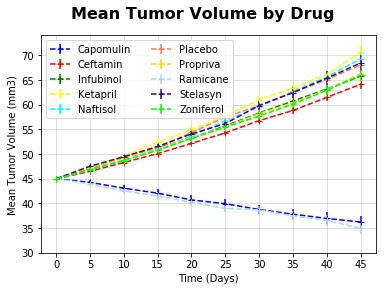
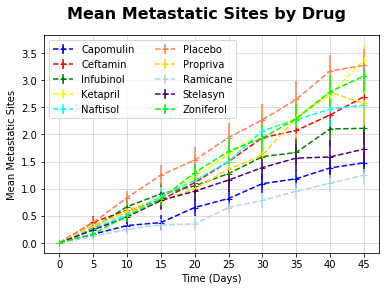
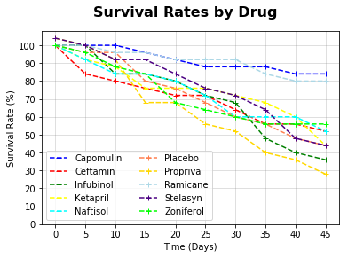
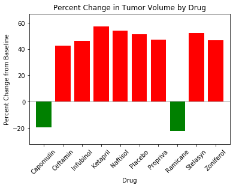

# Pymaceuticals Inc

## Observed Trends

# Trend 1
    * Capomulin and Ramicane reduced tumor volumes in the sample over 45 days
    
# Trend 2
    * No drug in the study was able to reduce the number of metastatic sites in the sample over 45 days
    
# Trend 3
    * The Capomulin and Ramicane samples had notably higher survival rates than other drugs, hinting at a relationship between tumor volume and survival. 
    * Future research could involve a correlation test to assess the signifcance and strength of the relationships between survival, tumor volume, and metastatic sites.

## Import Dependencies, Read Files Into Dataframes and Merge on ID


```python
import matplotlib.pyplot as plt
import pandas as pd
import numpy as np
import os
import scipy.stats as stats
```


```python
meds = os.path.join('raw_data', 'mouse_drug_data.csv')
mouse_data = os.path.join('raw_data', 'clinicaltrial_data.csv')
```


```python
meds_df = pd.read_csv(meds)
mouse_data_df = pd.read_csv(mouse_data)
mouse_data_df.head()
```


<div>
<style scoped>
    .dataframe tbody tr th:only-of-type {
        vertical-align: middle;
    }

    .dataframe tbody tr th {
        vertical-align: top;
    }

    .dataframe thead th {
        text-align: right;
    }
</style>
<table border="1" class="dataframe">
  <thead>
    <tr style="text-align: right;">
      <th></th>
      <th>Mouse ID</th>
      <th>Timepoint</th>
      <th>Tumor Volume (mm3)</th>
      <th>Metastatic Sites</th>
    </tr>
  </thead>
  <tbody>
    <tr>
      <th>0</th>
      <td>b128</td>
      <td>0</td>
      <td>45.0</td>
      <td>0</td>
    </tr>
    <tr>
      <th>1</th>
      <td>f932</td>
      <td>0</td>
      <td>45.0</td>
      <td>0</td>
    </tr>
    <tr>
      <th>2</th>
      <td>g107</td>
      <td>0</td>
      <td>45.0</td>
      <td>0</td>
    </tr>
    <tr>
      <th>3</th>
      <td>a457</td>
      <td>0</td>
      <td>45.0</td>
      <td>0</td>
    </tr>
    <tr>
      <th>4</th>
      <td>c819</td>
      <td>0</td>
      <td>45.0</td>
      <td>0</td>
    </tr>
  </tbody>
</table>
</div>


```python
combined_data_df = pd.merge(meds_df, mouse_data_df, how='outer', on='Mouse ID')
combined_data_df.count()
```


    Mouse ID              1906
    Drug                  1906
    Timepoint             1906
    Tumor Volume (mm3)    1906
    Metastatic Sites      1906
    dtype: int64


# Tumor Response to Treatment by Drug

## Tables Depicting All Drugs


```python
med_groups = combined_data_df.groupby(['Drug','Timepoint'])
med_timeseries_df = pd.DataFrame(med_groups['Tumor Volume (mm3)'].mean())
#med_timeseries_df
```


```python
pivot_df = med_timeseries_df.reset_index().groupby(['Timepoint', 'Drug'])['Tumor Volume (mm3)'].aggregate('first').unstack()
pivot_df
```


<div>
<style scoped>
    .dataframe tbody tr th:only-of-type {
        vertical-align: middle;
    }

    .dataframe tbody tr th {
        vertical-align: top;
    }

    .dataframe thead th {
        text-align: right;
    }
</style>
<table border="1" class="dataframe">
  <thead>
    <tr style="text-align: right;">
      <th>Drug</th>
      <th>Capomulin</th>
      <th>Ceftamin</th>
      <th>Infubinol</th>
      <th>Ketapril</th>
      <th>Naftisol</th>
      <th>Placebo</th>
      <th>Propriva</th>
      <th>Ramicane</th>
      <th>Stelasyn</th>
      <th>Zoniferol</th>
    </tr>
    <tr>
      <th>Timepoint</th>
      <th></th>
      <th></th>
      <th></th>
      <th></th>
      <th></th>
      <th></th>
      <th></th>
      <th></th>
      <th></th>
      <th></th>
    </tr>
  </thead>
  <tbody>
    <tr>
      <th>0</th>
      <td>45.000000</td>
      <td>45.000000</td>
      <td>45.000000</td>
      <td>45.000000</td>
      <td>45.000000</td>
      <td>45.000000</td>
      <td>45.000000</td>
      <td>45.000000</td>
      <td>45.000000</td>
      <td>45.000000</td>
    </tr>
    <tr>
      <th>5</th>
      <td>44.266086</td>
      <td>46.503051</td>
      <td>47.062001</td>
      <td>47.389175</td>
      <td>46.796098</td>
      <td>47.125589</td>
      <td>47.248967</td>
      <td>43.944859</td>
      <td>47.527452</td>
      <td>46.851818</td>
    </tr>
    <tr>
      <th>10</th>
      <td>43.084291</td>
      <td>48.285125</td>
      <td>49.403909</td>
      <td>49.582269</td>
      <td>48.694210</td>
      <td>49.423329</td>
      <td>49.101541</td>
      <td>42.531957</td>
      <td>49.463844</td>
      <td>48.689881</td>
    </tr>
    <tr>
      <th>15</th>
      <td>42.064317</td>
      <td>50.094055</td>
      <td>51.296397</td>
      <td>52.399974</td>
      <td>50.933018</td>
      <td>51.359742</td>
      <td>51.067318</td>
      <td>41.495061</td>
      <td>51.529409</td>
      <td>50.779059</td>
    </tr>
    <tr>
      <th>20</th>
      <td>40.716325</td>
      <td>52.157049</td>
      <td>53.197691</td>
      <td>54.920935</td>
      <td>53.644087</td>
      <td>54.364417</td>
      <td>53.346737</td>
      <td>40.238325</td>
      <td>54.067395</td>
      <td>53.170334</td>
    </tr>
    <tr>
      <th>25</th>
      <td>39.939528</td>
      <td>54.287674</td>
      <td>55.715252</td>
      <td>57.678982</td>
      <td>56.731968</td>
      <td>57.482574</td>
      <td>55.504138</td>
      <td>38.974300</td>
      <td>56.166123</td>
      <td>55.432935</td>
    </tr>
    <tr>
      <th>30</th>
      <td>38.769339</td>
      <td>56.769517</td>
      <td>58.299397</td>
      <td>60.994507</td>
      <td>59.559509</td>
      <td>59.809063</td>
      <td>58.196374</td>
      <td>38.703137</td>
      <td>59.826738</td>
      <td>57.713531</td>
    </tr>
    <tr>
      <th>35</th>
      <td>37.816839</td>
      <td>58.827548</td>
      <td>60.742461</td>
      <td>63.371686</td>
      <td>62.685087</td>
      <td>62.420615</td>
      <td>60.350199</td>
      <td>37.451996</td>
      <td>62.440699</td>
      <td>60.089372</td>
    </tr>
    <tr>
      <th>40</th>
      <td>36.958001</td>
      <td>61.467895</td>
      <td>63.162824</td>
      <td>66.068580</td>
      <td>65.600754</td>
      <td>65.052675</td>
      <td>63.045537</td>
      <td>36.574081</td>
      <td>65.356386</td>
      <td>62.916692</td>
    </tr>
    <tr>
      <th>45</th>
      <td>36.236114</td>
      <td>64.132421</td>
      <td>65.755562</td>
      <td>70.662958</td>
      <td>69.265506</td>
      <td>68.084082</td>
      <td>66.258529</td>
      <td>34.955595</td>
      <td>68.438310</td>
      <td>65.960888</td>
    </tr>
  </tbody>
</table>
</div>


```python
drug_list = list(pivot_df)
drug_delta = []
for drug in drug_list:
    delta = float(((pivot_df.loc[[45],[drug]].values)-(pivot_df.loc[[0],[drug]].values))/(pivot_df.loc[[0],[drug]].values))*100
    drug_delta.append(delta)
#list(pivot_df.index.values) 
#drug_delta
colors = ['g' if drug < 0 else 'r' for drug in drug_delta]
plot_df = pd.DataFrame({'name' : drug_list, 
                        'delta' : drug_delta, 
                        'color': colors
                       })
#plot_df
```


```python
x_axis = combined_data_df['Timepoint'].unique()
```

## Capomulin


```python
capomulin = combined_data_df.loc[combined_data_df['Drug'] == 'Capomulin', :]
capomulin_mean = capomulin.groupby(['Timepoint']).mean()
capomulin_mean = capomulin_mean.rename(index=str, columns={"Metastatic Sites": "Metastatic Means", "Tumor Volume (mm3)": "Volume Means"})
capomulin_sem = capomulin.groupby(['Timepoint']).sem()
capomulin_sem = capomulin_sem.rename(index=str, columns={"Metastatic Sites": "Metastatic SEM", "Tumor Volume (mm3)": "Volume SEM"})
capomulin_survival = capomulin.groupby(['Timepoint'])['Mouse ID'].count()
capomulin_mean['Survival Rate (%)'] = [((m/25)*100) for m in capomulin_survival]
capomulin_mean['Metastatic SEM'] = capomulin_sem['Metastatic SEM']
capomulin_mean['Volume SEM'] = capomulin_sem['Volume SEM']
capomulin_df = capomulin_mean[['Volume Means', 'Volume SEM','Metastatic Means', 'Metastatic SEM','Survival Rate (%)']]
#capomulin_df
#capomulin
#capomulin_survival
```

## Ceftamin


```python
ceftamin = combined_data_df.loc[combined_data_df['Drug'] == 'Ceftamin', :]
ceftamin_mean = ceftamin.groupby(['Timepoint']).mean()
ceftamin_mean = ceftamin_mean.rename(index=str, columns={"Metastatic Sites": "Metastatic Means", "Tumor Volume (mm3)": "Volume Means"})
ceftamin_sem = ceftamin.groupby(['Timepoint']).sem()
ceftamin_sem = ceftamin_sem.rename(index=str, columns={"Metastatic Sites": "Metastatic SEM", "Tumor Volume (mm3)": "Volume SEM"})
ceftamin_survival = ceftamin.groupby(['Timepoint'])['Mouse ID'].count()
ceftamin_mean['Survival Rate (%)'] = [((m/25)*100) for m in ceftamin_survival]
ceftamin_mean['Metastatic SEM'] = ceftamin_sem['Metastatic SEM']
ceftamin_mean['Volume SEM'] = ceftamin_sem['Volume SEM']
ceftamin_df = ceftamin_mean[['Volume Means', 'Volume SEM','Metastatic Means', 'Metastatic SEM', 'Survival Rate (%)']]
#ceftamin_df
```

## Infubinol


```python
infubinol = combined_data_df.loc[combined_data_df['Drug'] == 'Infubinol', :]
infubinol_mean = infubinol.groupby(['Timepoint']).mean()
infubinol_mean = infubinol_mean.rename(index=str, columns={"Metastatic Sites": "Metastatic Means", "Tumor Volume (mm3)": "Volume Means"})
infubinol_sem = infubinol.groupby(['Timepoint']).sem()
infubinol_sem = infubinol_sem.rename(index=str, columns={"Metastatic Sites": "Metastatic SEM", "Tumor Volume (mm3)": "Volume SEM"})
infubinol_survival = infubinol.groupby(['Timepoint'])['Mouse ID'].count()
infubinol_mean['Survival Rate (%)'] = [((m/25)*100) for m in infubinol_survival]
infubinol_mean['Metastatic SEM'] = infubinol_sem['Metastatic SEM']
infubinol_mean['Volume SEM'] = infubinol_sem['Volume SEM']
infubinol_df = infubinol_mean[['Volume Means', 'Volume SEM','Metastatic Means', 'Metastatic SEM', 'Survival Rate (%)']]
#infubinol_df
```

## Ketapril


```python
ketapril = combined_data_df.loc[combined_data_df['Drug'] == 'Ketapril', :]
ketapril_mean = ketapril.groupby(['Timepoint']).mean()
ketapril_mean = ketapril_mean.rename(index=str, columns={"Metastatic Sites": "Metastatic Means", "Tumor Volume (mm3)": "Volume Means"})
ketapril_sem = ketapril.groupby(['Timepoint']).sem()
ketapril_sem = ketapril_sem.rename(index=str, columns={"Metastatic Sites": "Metastatic SEM", "Tumor Volume (mm3)": "Volume SEM"})
ketapril_survival = ketapril.groupby(['Timepoint'])['Mouse ID'].count()
ketapril_mean['Survival Rate (%)'] = [((m/25)*100) for m in ketapril_survival]
ketapril_mean['Metastatic SEM'] = ketapril_sem['Metastatic SEM']
ketapril_mean['Volume SEM'] = ketapril_sem['Volume SEM']
ketapril_df = ketapril_mean[['Volume Means', 'Volume SEM','Metastatic Means', 'Metastatic SEM', 'Survival Rate (%)']]
#ketapril_df
```

## Naftisol


```python
naftisol = combined_data_df.loc[combined_data_df['Drug'] == 'Naftisol', :]
naftisol_mean = naftisol.groupby(['Timepoint']).mean()
naftisol_mean = naftisol_mean.rename(index=str, columns={"Metastatic Sites": "Metastatic Means", "Tumor Volume (mm3)": "Volume Means"})
naftisol_sem = naftisol.groupby(['Timepoint']).sem()
naftisol_sem = naftisol_sem.rename(index=str, columns={"Metastatic Sites": "Metastatic SEM", "Tumor Volume (mm3)": "Volume SEM"})
naftisol_survival = naftisol.groupby(['Timepoint'])['Mouse ID'].count()
naftisol_mean['Survival Rate (%)'] = [((m/25)*100) for m in naftisol_survival]
naftisol_mean['Metastatic SEM'] = naftisol_sem['Metastatic SEM']
naftisol_mean['Volume SEM'] = naftisol_sem['Volume SEM']
naftisol_df = naftisol_mean[['Volume Means', 'Volume SEM','Metastatic Means', 'Metastatic SEM', 'Survival Rate (%)']]
#naftisol_df
```

## Placebo


```python
placebo = combined_data_df.loc[combined_data_df['Drug'] == 'Placebo', :]
placebo_mean = placebo.groupby(['Timepoint']).mean()
placebo_mean = placebo_mean.rename(index=str, columns={"Metastatic Sites": "Metastatic Means", "Tumor Volume (mm3)": "Volume Means"})
placebo_sem = placebo.groupby(['Timepoint']).sem()
placebo_sem = placebo_sem.rename(index=str, columns={"Metastatic Sites": "Metastatic SEM", "Tumor Volume (mm3)": "Volume SEM"})
placebo_survival = placebo.groupby(['Timepoint'])['Mouse ID'].count()
placebo_mean['Survival Rate (%)'] = [((m/25)*100) for m in placebo_survival]
placebo_mean['Metastatic SEM'] = placebo_sem['Metastatic SEM']
placebo_mean['Volume SEM'] = placebo_sem['Volume SEM']
placebo_df = placebo_mean[['Volume Means', 'Volume SEM','Metastatic Means', 'Metastatic SEM', 'Survival Rate (%)']]
#placebo_df
```

## Propriva


```python
propriva = combined_data_df.loc[combined_data_df['Drug'] == 'Propriva', :]
propriva_mean = propriva.groupby(['Timepoint']).mean()
propriva_mean = propriva_mean.rename(index=str, columns={"Metastatic Sites": "Metastatic Means", "Tumor Volume (mm3)": "Volume Means"})
propriva_sem = propriva.groupby(['Timepoint']).sem()
propriva_sem = propriva_sem.rename(index=str, columns={"Metastatic Sites": "Metastatic SEM", "Tumor Volume (mm3)": "Volume SEM"})
propriva_survival = propriva.groupby(['Timepoint'])['Mouse ID'].count()
propriva_mean['Survival Rate (%)'] = [((m/25)*100) for m in propriva_survival]
propriva_mean['Metastatic SEM'] = propriva_sem['Metastatic SEM']
propriva_mean['Volume SEM'] = propriva_sem['Volume SEM']
propriva_df = propriva_mean[['Volume Means', 'Volume SEM','Metastatic Means', 'Metastatic SEM', 'Survival Rate (%)']]
#propriva_df
```

## Ramicane


```python
ramicane = combined_data_df.loc[combined_data_df['Drug'] == 'Ramicane', :]
ramicane_mean = ramicane.groupby(['Timepoint']).mean()
ramicane_mean = ramicane_mean.rename(index=str, columns={"Metastatic Sites": "Metastatic Means", "Tumor Volume (mm3)": "Volume Means"})
ramicane_sem = ramicane.groupby(['Timepoint']).sem()
ramicane_sem = ramicane_sem.rename(index=str, columns={"Metastatic Sites": "Metastatic SEM", "Tumor Volume (mm3)": "Volume SEM"})
ramicane_survival = ramicane.groupby(['Timepoint'])['Mouse ID'].count()
ramicane_mean['Survival Rate (%)'] = [((m/25)*100) for m in ramicane_survival]
ramicane_mean['Metastatic SEM'] = ramicane_sem['Metastatic SEM']
ramicane_mean['Volume SEM'] = ramicane_sem['Volume SEM']
ramicane_df = ramicane_mean[['Volume Means', 'Volume SEM','Metastatic Means', 'Metastatic SEM', 'Survival Rate (%)']]
#ramicane_df
```

## Stelasyn


```python
stelasyn = combined_data_df.loc[combined_data_df['Drug'] == 'Stelasyn', :]
stelasyn_mean = stelasyn.groupby(['Timepoint']).mean()
stelasyn_mean = stelasyn_mean.rename(index=str, columns={"Metastatic Sites": "Metastatic Means", "Tumor Volume (mm3)": "Volume Means"})
stelasyn_sem = stelasyn.groupby(['Timepoint']).sem()
stelasyn_sem = stelasyn_sem.rename(index=str, columns={"Metastatic Sites": "Metastatic SEM", "Tumor Volume (mm3)": "Volume SEM"})
stelasyn_survival = stelasyn.groupby(['Timepoint'])['Mouse ID'].count()
stelasyn_mean['Survival Rate (%)'] = [((m/25)*100) for m in stelasyn_survival]
stelasyn_mean['Metastatic SEM'] = stelasyn_sem['Metastatic SEM']
stelasyn_mean['Volume SEM'] = stelasyn_sem['Volume SEM']
stelasyn_df = stelasyn_mean[['Volume Means', 'Volume SEM','Metastatic Means', 'Metastatic SEM', 'Survival Rate (%)']]
#stelasyn_df
```

## Zoniferol


```python
zoniferol = combined_data_df.loc[combined_data_df['Drug'] == 'Zoniferol', :]
zoniferol_mean = zoniferol.groupby(['Timepoint']).mean()
zoniferol_mean = zoniferol_mean.rename(index=str, columns={"Metastatic Sites": "Metastatic Means", "Tumor Volume (mm3)": "Volume Means"})
zoniferol_sem = zoniferol.groupby(['Timepoint']).sem()
zoniferol_sem = zoniferol_sem.rename(index=str, columns={"Metastatic Sites": "Metastatic SEM", "Tumor Volume (mm3)": "Volume SEM"})
zoniferol_survival = zoniferol.groupby(['Timepoint'])['Mouse ID'].count()
zoniferol_mean['Survival Rate (%)'] = [((m/25)*100) for m in zoniferol_survival]
zoniferol_mean['Metastatic SEM'] = zoniferol_sem['Metastatic SEM']
zoniferol_mean['Volume SEM'] = zoniferol_sem['Volume SEM']
zoniferol_df = zoniferol_mean[['Volume Means', 'Volume SEM','Metastatic Means', 'Metastatic SEM', 'Survival Rate (%)']]
#zoniferol_df
```

## Tumor Volume Plot


```python
plt.errorbar(x_axis, capomulin_df['Volume Means'], yerr=capomulin_df['Volume SEM'],marker ='+', color='blue', ls='dashed', label="Capomulin")
plt.errorbar(x_axis, ceftamin_df['Volume Means'], yerr=ceftamin_df['Volume SEM'],marker ='+', color='red', ls='dashed', label="Ceftamin")
plt.errorbar(x_axis, infubinol_df['Volume Means'], yerr=infubinol_df['Volume SEM'],marker ='+', color='green', ls='dashed', label="Infubinol")
plt.errorbar(x_axis, ketapril_df['Volume Means'], yerr=ketapril_df['Volume SEM'],marker ='+', color='yellow', ls='dashed', label="Ketapril")
plt.errorbar(x_axis, naftisol_df['Volume Means'], yerr=naftisol_df['Volume SEM'],marker ='+', color='aqua', ls='dashed', label="Naftisol")
plt.errorbar(x_axis, placebo_df['Volume Means'], yerr=placebo_df['Volume SEM'],marker ='+', color='coral', ls='dashed', label="Placebo")
plt.errorbar(x_axis, propriva_df['Volume Means'], yerr=propriva_df['Volume SEM'],marker ='+', color='gold', ls='dashed', label="Propriva")
plt.errorbar(x_axis, ramicane_df['Volume Means'], yerr=ramicane_df['Volume SEM'],marker ='+', color='lightblue', ls='dashed', label="Ramicane")
plt.errorbar(x_axis, stelasyn_df['Volume Means'], yerr=stelasyn_df['Volume SEM'],marker ='+', color='indigo', ls='dashed', label="Stelasyn")
plt.errorbar(x_axis, zoniferol_df['Volume Means'], yerr=zoniferol_df['Volume SEM'],marker ='+', color='lime', ls='dashed', label="Zoniferol")
plt.grid(color='grey', linestyle='-', linewidth=1, alpha=0.25)
plt.xticks(np.arange(0, 50, step=5))
plt.yticks(np.arange(30, 75, step=5))
plt.legend(loc="upper left", ncol=2)
plt.xlabel("Time (Days)")
plt.ylabel("Mean Tumor Volume (mm3)")
plt.suptitle("Mean Tumor Volume by Drug", fontsize=16, fontweight="bold")
plt.show()
```





## Metastatic Sites Plot


```python
plt.errorbar(x_axis, capomulin_df['Metastatic Means'], yerr=capomulin_df['Metastatic SEM'],marker ='+', color='blue', ls='dashed', label="Capomulin")
plt.errorbar(x_axis, ceftamin_df['Metastatic Means'], yerr=ceftamin_df['Metastatic SEM'],marker ='+', color='red', ls='dashed', label="Ceftamin")
plt.errorbar(x_axis, infubinol_df['Metastatic Means'], yerr=infubinol_df['Metastatic SEM'],marker ='+', color='green', ls='dashed', label="Infubinol")
plt.errorbar(x_axis, ketapril_df['Metastatic Means'], yerr=ketapril_df['Metastatic SEM'],marker ='+', color='yellow', ls='dashed', label="Ketapril")
plt.errorbar(x_axis, naftisol_df['Metastatic Means'], yerr=naftisol_df['Metastatic SEM'],marker ='+', color='aqua', ls='dashed', label="Naftisol")
plt.errorbar(x_axis, placebo_df['Metastatic Means'], yerr=placebo_df['Metastatic SEM'],marker ='+', color='coral', ls='dashed', label="Placebo")
plt.errorbar(x_axis, propriva_df['Metastatic Means'], yerr=propriva_df['Metastatic SEM'],marker ='+', color='gold', ls='dashed', label="Propriva")
plt.errorbar(x_axis, ramicane_df['Metastatic Means'], yerr=ramicane_df['Metastatic SEM'],marker ='+', color='lightblue', ls='dashed', label="Ramicane")
plt.errorbar(x_axis, stelasyn_df['Metastatic Means'], yerr=stelasyn_df['Metastatic SEM'],marker ='+', color='indigo', ls='dashed', label="Stelasyn")
plt.errorbar(x_axis, zoniferol_df['Metastatic Means'], yerr=zoniferol_df['Metastatic SEM'],marker ='+', color='lime', ls='dashed', label="Zoniferol")
plt.grid(color='grey', linestyle='-', linewidth=1, alpha=0.25)
plt.xticks(np.arange(0, 50, step=5))
plt.yticks(np.arange(0, 3.75, step=.5))
plt.legend(loc="upper left", ncol=2)
plt.xlabel("Time (Days)")
plt.ylabel("Mean Metastatic Sites")
plt.suptitle("Mean Metastatic Sites by Drug", fontsize=16, fontweight="bold")
plt.show()
```





## Survival Counts


```python
plt.plot(x_axis, capomulin_df['Survival Rate (%)'], marker ='+', color='blue', ls='dashed', label="Capomulin")
plt.plot(x_axis, ceftamin_df['Survival Rate (%)'], marker ='+', color='red', ls='dashed', label="Ceftamin")
plt.plot(x_axis, infubinol_df['Survival Rate (%)'], marker ='+', color='green', ls='dashed', label="Infubinol")
plt.plot(x_axis, ketapril_df['Survival Rate (%)'], marker ='+', color='yellow', ls='dashed', label="Ketapril")
plt.plot(x_axis, naftisol_df['Survival Rate (%)'], marker ='+', color='aqua', ls='dashed', label="Naftisol")
plt.plot(x_axis, placebo_df['Survival Rate (%)'], marker ='+', color='coral', ls='dashed', label="Placebo")
plt.plot(x_axis, propriva_df['Survival Rate (%)'], marker ='+', color='gold', ls='dashed', label="Propriva")
plt.plot(x_axis, ramicane_df['Survival Rate (%)'], marker ='+', color='lightblue', ls='dashed', label="Ramicane")
plt.plot(x_axis, stelasyn_df['Survival Rate (%)'], marker ='+', color='indigo', ls='dashed', label="Stelasyn")
plt.plot(x_axis, zoniferol_df['Survival Rate (%)'], marker ='+', color='lime', ls='dashed', label="Zoniferol")
plt.grid(color='grey', linestyle='-', linewidth=1, alpha=0.25)
plt.xticks(np.arange(0, 50, step=5))
plt.yticks(np.arange(0, 110, step=10))
plt.legend(loc="lower left", ncol=2)
plt.xlabel("Time (Days)")
plt.ylabel("Survival Rate (%)")
plt.suptitle("Survival Rates by Drug", fontsize=16, fontweight="bold")
plt.show()
```





```python
plt.bar(plot_df['name'], plot_df['delta'], color=(plot_df['color']))
plt.title("Percent Change in Tumor Volume by Drug")
plt.xlabel("Drug")
plt.ylabel("Percent Change from Baseline")
plt.ylim(min(drug_delta)-10, max(drug_delta)+10)
plt.xlim(-0.75, len(drug_list)-0.25)
tick_locations = [value for value in drug_list]
plt.xticks(tick_locations, drug_list, rotation=45)
plt.hlines(0, -1, len(drug_list), alpha=0.25)
```


    <matplotlib.collections.LineCollection at 0x1a1664cb38>




